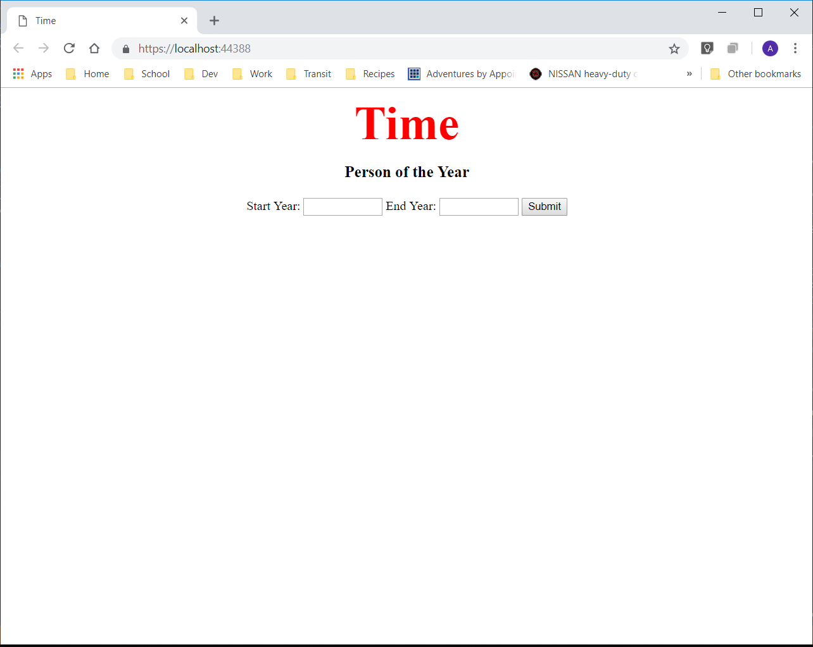
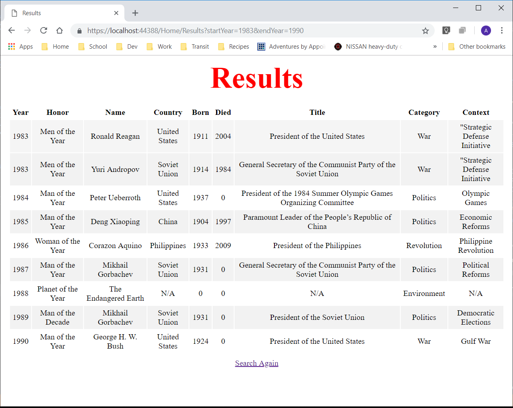

# Lab11-My First MVC App
Time Magazine person of the year search

## Overview
Use this web application to view the Time Magazine Person of the Year for any year from 1927 to 2016. Input a start and end years on this application and see a list of people for those years. The application will also give information about each person and why they were selected as person of the year.

## Specifications
- Full-Stack MVC Web Application
- Languages: C#, HTML, CSS
- Framework: ASP.NET Core

## Usage
### Home Page

### Results Page

